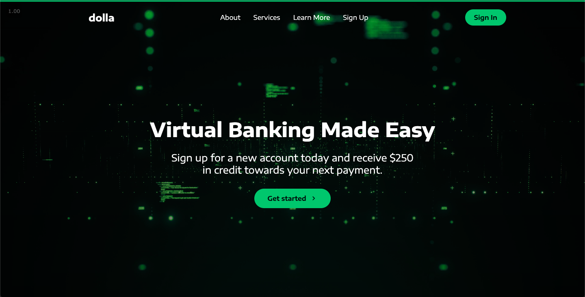
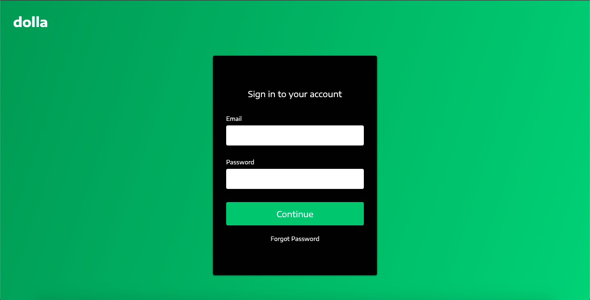

## Dolla

Website for a bank company created with ReactJS. Feel free to access: https://dolla-mybank.netlify.app/
 
Its homepage looks like this:
 
 

 
Underneath this introduction, you find this page with some informations about the company:
 
 

 
You can see the services the bank offers you:
 
 

 
Clicking on the Sign In button, you are redirected to the Sign In page, in which you can acces your account (in this project the backend wasn't implemented yet, so only the front-end works):
 
 

 
Observations: This website does not belongs to a real company, it just a personal project with the only goal to improve my skills in React.